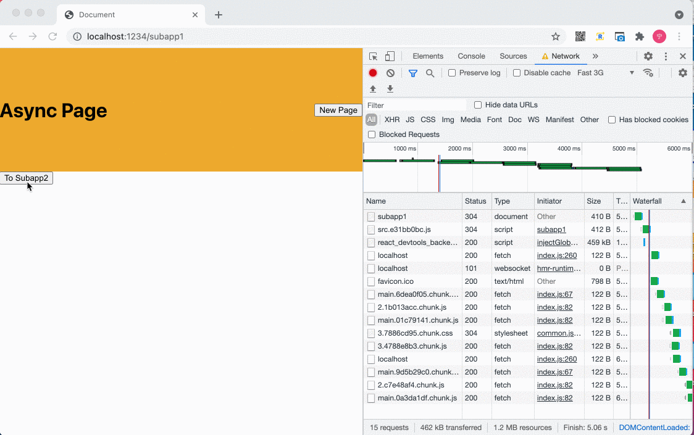

# A demo of qiankun dynamic import style bug

## Gif

## Steps

- Run `yarn` to install all the dependencies
- Run `npm run build-and-serve` to start the server
- Visit http://locahost:1234/subapp1
- Open Fast 3G network throttling (For more significant)
- Click `To Subapp2` button
- Click `To Subapp1` button
- Then we will back to the subapp1 page.The bug reproduced. The container miss the background color and flex layout until the css file loaded.
